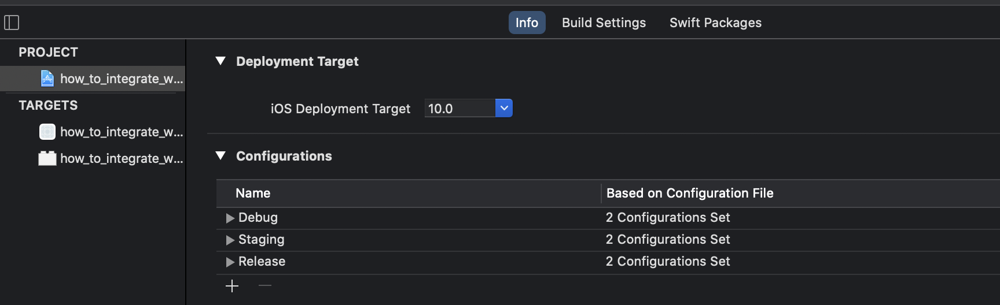
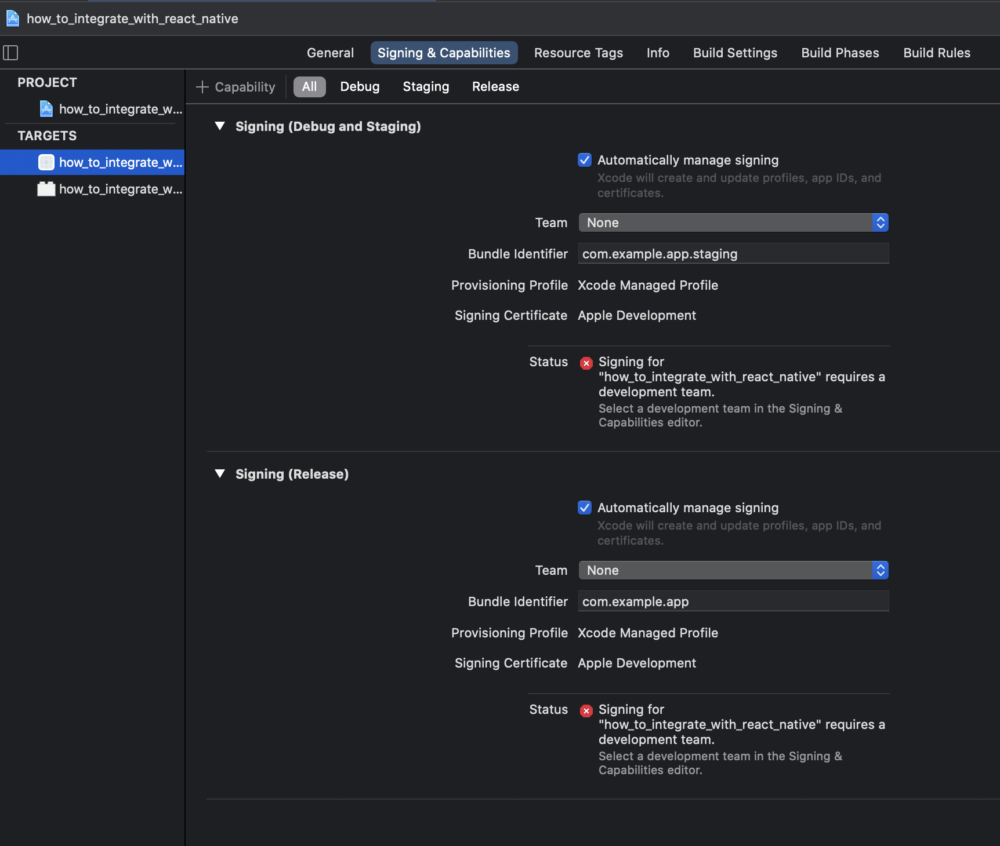
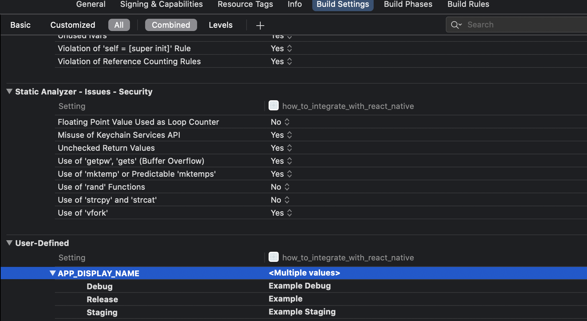

# How to integrate React Native Config

**Library Repo:** https://github.com/luggit/react-native-config

**Versions:**

- react-native: 0.63.4
- react-native-config: 1.4.2

**Platforms:**

- iOS
- Android

**XCode Changes**

- Staging Configuration
- Staging and Production bundle identifier
- App Name Setting. Don't forget change info.plist 

**CAUTIONS**

- You have to generate your own private release.keystore (for Android)
- I deleted tvOS and tvOSTests. You don't have to do this. It's up to you (for iOS)
